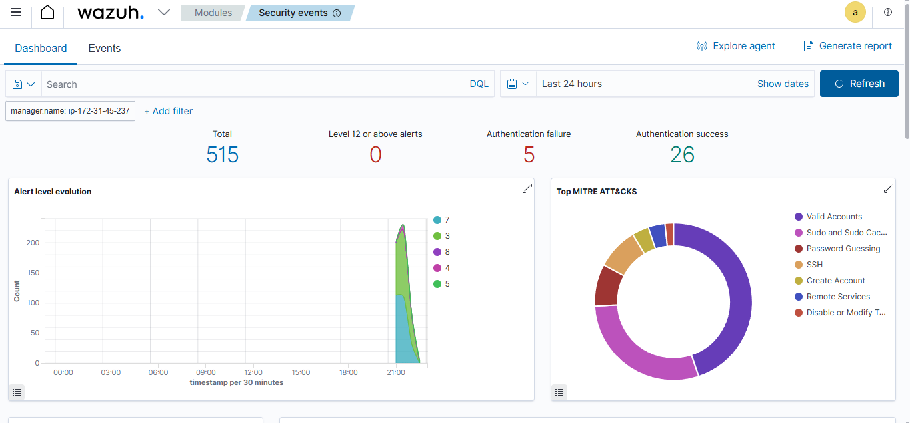
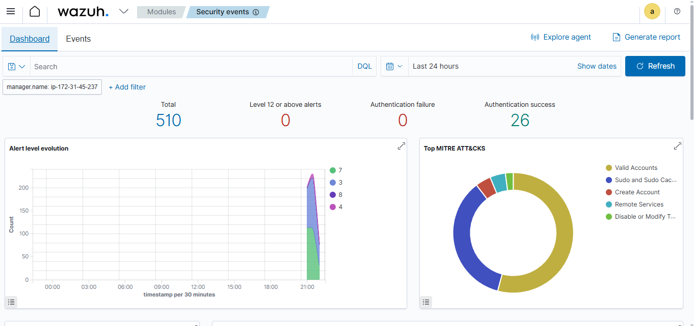
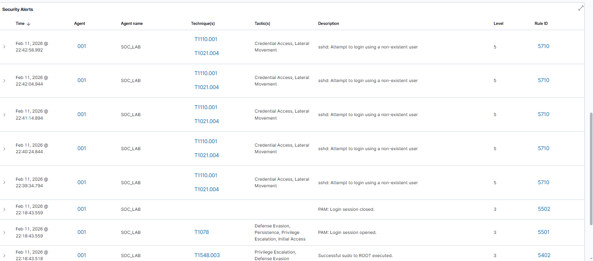
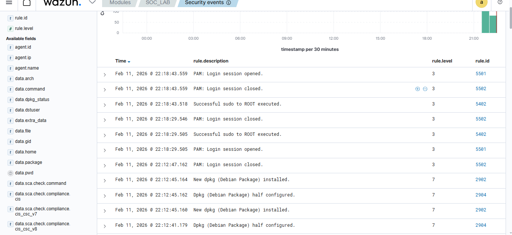

# SOC Home Lab using Wazuh SIEM on AWS EC2

---

## 📌 Project Title

SOC Home Lab: Endpoint Monitoring & Detection using Wazuh SIEM on AWS EC2

---

## 📖 Overview

This project demonstrates building a cloud-based Security Operations Center (SOC) home lab using Wazuh SIEM deployed on AWS EC2. The lab focuses on endpoint monitoring, log collection, alerting, and basic incident response aligned with L1 SOC analyst responsibilities.

All documentation, evidence, and explanations are provided inside this single README file.

---

## 🎯 Objectives

* Deploy Wazuh Manager and Agent on AWS EC2
* Collect and analyze endpoint logs
* Simulate common attacks
* Detect and investigate security events
* Document incidents and findings

---

## 🧱 Architecture

Wazuh Manager (Ubuntu EC2)
|
|
Wazuh Agent (Ubuntu EC2)

---

## 🛠 Tools & Technologies

* AWS EC2
* Ubuntu 22.04
* Wazuh SIEM
* SSH

---

## ⚙ Installation Summary

### Wazuh Manager Setup (Minimal)

Deployed Ubuntu 22.04 EC2 instance and installed Wazuh using official script:

```bash
curl -sO https://packages.wazuh.com/4.7/wazuh-install.sh
sudo bash wazuh-install.sh -a
```

Verified services:

```bash
sudo systemctl status wazuh-manager
sudo systemctl status wazuh-dashboard
```

Accessed dashboard:

```
https://<MANAGER_PUBLIC_IP>
```

---

### Agent Deployment (Via Manager Wizard)

1. Opened Wazuh Dashboard → Agents → Deploy New Agent
2. Selected:

   * Operating System: Linux
   * Package: DEB amd64
   * Server address: <MANAGER_PUBLIC_IP>
3. Copied generated installation command and executed on Agent EC2:

```bash
curl -sO https://packages.wazuh.com/4.x/wazuh-agent_4.x.x-1_amd64.deb
sudo WAZUH_MANAGER='<MANAGER_PUBLIC_IP>' dpkg -i wazuh-agent_4.x.x-1_amd64.deb
```

Started and enabled agent service:

```bash
sudo systemctl daemon-reload
sudo systemctl enable wazuh-agent
sudo systemctl start wazuh-agent
sudo systemctl status wazuh-agent
```

Confirmed agent appears as **Active** in dashboard.

This approach represents a minimal, correct, and production-style deployment.

1. Launched two Ubuntu EC2 instances
2. Installed Wazuh Manager on Instance 1
3. Installed Wazuh Agent on Instance 2
4. Registered agent with manager
5. Verified agent is active in dashboard

---

## 📸 Screenshots (Evidence)

The following screenshots are included as proof of deployment and detections:

### Wazuh Dashboard Overview

Shows SOC modules, alert graphs, and MITRE ATT&CK mapping



---

### Wazuh Main Dashboard (Modules View)



---

### Active Agent

SOC_LAB agent reporting as Active


---

### SSH Authentication Failures (Brute Force Evidence)

Multiple attempts to login using non-existent user (Rule ID 5710)



---

### Security Events List

Shows authentication failures, PAM sessions, and sudo activity



---

### Active Agent

SOC_LAB agent reporting as Active


---

### Security Events

Shows sudo activity, PAM login sessions, and dpkg package installation alerts


---

## 🔥 Attack Simulations Performed

### 0) SSH Brute Force (Authentication Failure Correlation)

Command used from attacker machine:

```bash
ssh ubuntu@AGENT_PUBLIC_IP
```

Repeated wrong password attempts were performed.

Observed Alerts:

* sshd: Attempt to login using a non-existent user (Rule ID 5710)

Correlation:
Multiple Rule 5710 events within short timeframe indicate SSH brute-force behavior.

---

### 1) Privilege Escalation

Command used:

```bash
sudo nano /etc/ssh/sshd_config
sudo systemctl restart ssh
```

Observed Alert:

* Successful sudo to ROOT executed (Rule ID 5402)

---

### 3) Login Session Activity

Occurs when user logs in or runs sudo

Observed Alerts:

* PAM: Login session opened (Rule ID 5501)
* PAM: Login session closed (Rule ID 5502)

---

## 🔍 Observed Alerts (Analysis)

| Rule ID | Description                      | Severity | Meaning                       |
| ------- | -------------------------------- | -------- | ----------------------------- |
| 5402    | Successful sudo to ROOT executed | 3        | Privilege escalation activity |
| 5501    | PAM login session opened         | 3        | User session started          |
| 5502    | PAM login session closed         | 3        | User session ended            |

---

## 📑 Sample Incident Report

**Title:** Privilege Escalation via sudo

**Host:** SOC_LAB

**Severity:** Medium

**Description:**
Multiple sudo commands executed by user ubuntu resulting in root-level access.

**Evidence:**
Wazuh rule 5402 triggered multiple times.

**Action Taken:**
Verified activity was part of lab testing.

**Recommendation:**
Monitor sudo usage and create correlation rules for repeated sudo activity.

---

## 📌 Results

* Wazuh Manager and Agent successfully deployed
* Agent active and sending logs
* Security events visible in dashboard
* Multiple attack simulations detected

---

## 📈 Skills Demonstrated

* SIEM deployment
* Log analysis
* Alert triage
* Endpoint monitoring
* Incident documentation

---

## ✅ Conclusion

This project demonstrates hands-on SOC analyst skills in monitoring, detection, and basic incident response using a cloud-based Wazuh SIEM lab.

---

## 📄 Resume Bullet

Built cloud-based SOC home lab using Wazuh SIEM on AWS EC2 to detect SSH brute-force attempts, privilege escalation, and authentication activity.

---

End of README
